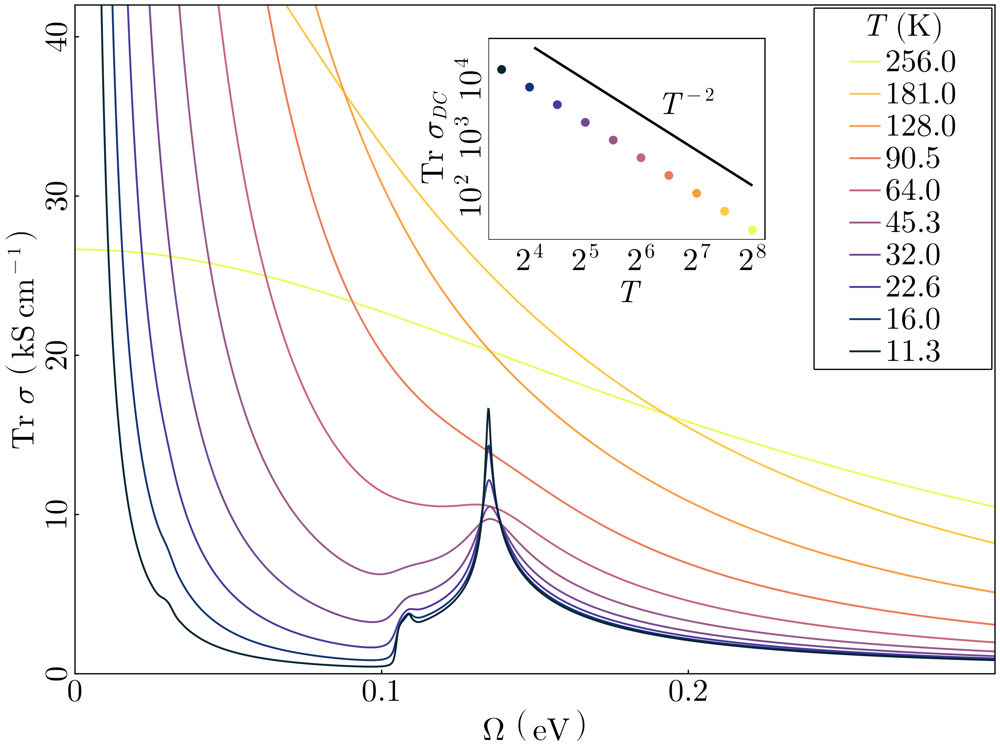

# Summary

In recent years, open source DFT codes combined with tools such as Wannier90
have enabled high-throughput materials searches by robustly calculating the
electronic structure of many metals and crystals from first principles. To
compare theory and experiment, the last step in predicting the electronic and
optical properties of these solids is calculating integrals to obtain quantities
such as the dielectric function, the density of states (DOS), and the Hall
conductivity. Often the details of the electronic structure may very sensitively
control the resonant features of these observable quantities, which makes it
crucial that this final step in many material-realistic calculations be as
accurate as possible and reflect underlying theoretical predictions. We
developed AutoBZ.jl to explore efficient algorithms and codes for the
challenging, nearly singular integrals that occur in response function
calculations that commonly arise in problems solid-state physics. Designed on
open-source software principles and written in Julia, our package enables
high-order accurate and parallelizable optical conductivity and DOS calculations
at challenging sub-meV energy scales and serves as an extensible framework for
future projects on materials response phenomena.

# Statement of need

and referenced from text using \autoref{fig:oc}.

[@tsirkinHighPerformanceWannier2021]

# Acknowledgements

We thank ... for helpful discussions.
The Flatiron Institute is a division of the Simons Foundation. 

# References